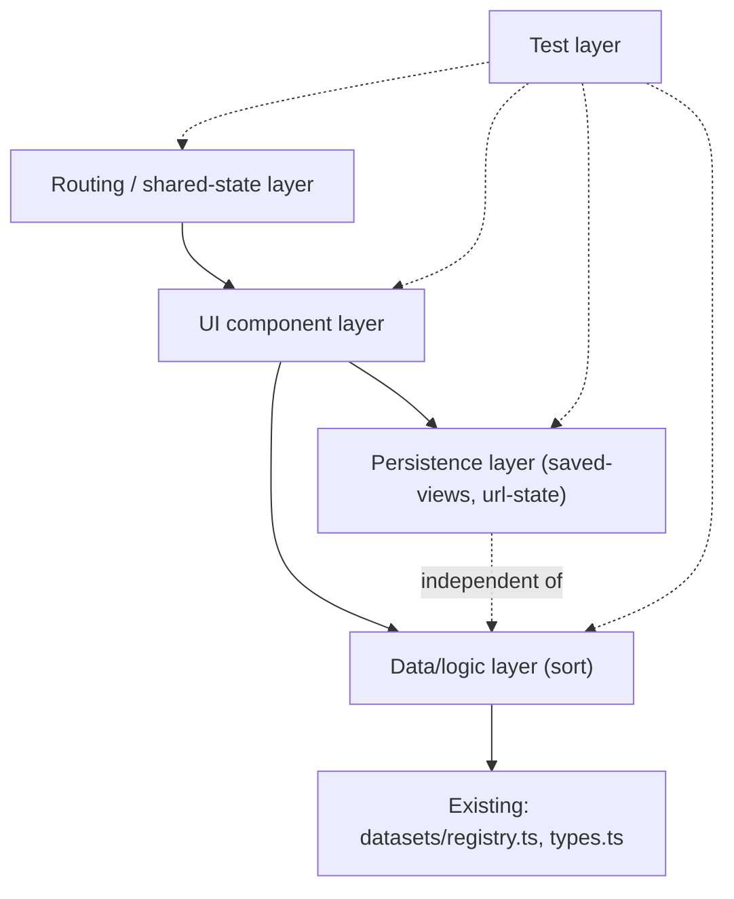

# Horizontal Plan: Advanced Power-User Tab

## 1. Layer Inventory

- **Routing/shared-state layer** — the new `/mapstack/advanced` route and the URL-param contract shared with the existing `/` route.
- **UI component layer** — `PowerUserPanel` and its subcomponents (layer picker, comparison table).
- **Data/logic layer** — single-criterion sort over the city list (`src/lib/power-user/sort.ts`).
- **Persistence layer** — saved-view storage (`src/lib/saved-views.ts`) and URL-state encode/decode (`src/lib/url-state.ts`).
- **Test layer** — Vitest unit coverage + Playwright e2e coverage for the above.

## 2. Per-Layer Requirements

### Routing/shared-state layer

- Responsibility: host the power-user surface at a real, bookmarkable URL; carry `selectedCityId` and `year` between `/` and `/mapstack/advanced` without a shared store.
- Key files/seams: new `src/app/advanced/page.tsx`; a small shared helper (new, e.g. `src/lib/shared-view-params.ts`) so both routes read/write the same param names (`city`, `year`) — this directly addresses design-discussion §4's low-severity risk of a naming mismatch between the two routes.
- Overall need: read `city`/`year` from `useSearchParams()` on mount in both routes; write them on change via `router.replace` (no full navigation) so the URL always reflects current selection.
- Dependencies: Next.js App Router APIs already in use elsewhere in the app (`src/app/page.tsx`, `src/app/layout.tsx`); no new routing library.

### UI component layer

- Responsibility: let the user pick 2+ (dataset, layer) pairs, see a per-city comparison table with per-column methodology notes, and sort by any one column.
- Key files/seams: new `src/components/PowerUserPanel.tsx` (top-level), likely `src/components/ComparisonTable.tsx` and `src/components/LayerPicker.tsx` as subcomponents; reuses `src/lib/datasets/registry.ts` (`DATASETS`), `src/lib/active-layers.ts` (`ActiveLayer`, `resolveActiveLayer`), and `src/components/CityDetailPanel.tsx`'s `CITY_BY_ID` city lookup pattern.
- Overall need: checkbox multi-select for (dataset, layer) pairs (interaction pattern reviewed from allergy-locator's `ProfileCompare.tsx`), a table with one column per selection plus a methodology-note header, and a sortable column-header control.
- Dependencies: the data/logic layer's sort function; the persistence layer for save/restore.

### Data/logic layer

- Responsibility: given a set of selected (dataset, layer) pairs and a chosen sort column, return a sorted city list. No cross-dataset combination math (explicitly excluded per design-discussion §3.3/U1).
- Key files/seams: new `src/lib/power-user/sort.ts`. Reads city values via each dataset's existing `getValue(cityId, layerId, context)` — does not modify `src/lib/datasets/types.ts`.
- Overall need: pure function(s), easily unit-testable, operating over `data/cities.json`'s city list and the registry's datasets.
- Dependencies: `src/lib/datasets/registry.ts`, `src/lib/datasets/types.ts` (read-only).

### Persistence layer

- Responsibility: let a user save a named view (selections + sort choice) and restore it later, both via localStorage (durable) and URL (shareable/restorable).
- Key files/seams: new `src/lib/saved-views.ts` (adapted from `/Users/mdostal/Code/allergy-locator/src/lib/profiles.ts` — SSR-safe, fail-open-on-corrupt-JSON CRUD pattern) and new `src/lib/url-state.ts` (adapted from that project's companion module).
- Overall need: `{id, name, selections: ActiveLayer[], sortBy, savedAt}` shape; CRUD functions (`getSavedViews`, `saveView`, `deleteView`, `renameView`); a mapstack-specific localStorage key (e.g. `mapstack:saved-views`, distinct from allergy-locator's own key namespace).
- Dependencies: none beyond browser localStorage/URL APIs; consumed by the UI layer.

### Test layer

- Responsibility: verify sort correctness, saved-view CRUD (incl. fail-open behavior), and the end-to-end route/compare/sort/persist flow.
- Key files/seams: new `tests/power-user-sort.test.ts`, `tests/saved-views.test.ts` (Vitest, following the existing `tests/*.test.ts` convention); new `tests/e2e/power-user-tab.spec.ts` (Playwright, following `tests/e2e/mapstack.spec.ts`'s convention).
- Overall need: matches the Verification Strategy in design-discussion.md §7.
- Dependencies: all layers above must exist before their corresponding tests can pass (tests are written alongside/after each layer, per the `classic` methodology's research → implement → test → review → integrate step order).

## 3. Cross-Layer Dependencies

- The **routing layer** is the integration seam between the existing simple view and every new layer — it's the only place `city`/`year` state crosses between the old and new surfaces.
- The **UI layer** depends on the **data/logic layer** for sort results and the **persistence layer** for save/restore — it does not implement either itself.
- The **data/logic layer** depends only on the existing `datasets/registry.ts` + `datasets/types.ts` — it has no dependency on the UI or persistence layers (keeps it independently unit-testable).
- The **persistence layer** has no dependency on the data/logic layer — a saved view stores *selections*, not *computed results*, so persistence and sort logic can be built/tested in parallel.
- The **test layer** depends on all four other layers existing in at least a minimal form before its corresponding tests can be written meaningfully.

## 4. Scope Summary

This is a small-to-medium slice: ~7-8 new files, no changes to any existing
file's public contract (the `Dataset` interface, `registry.ts`, and
`active-layers.ts` are all read-only dependencies here). The UI layer carries
the most weight (new route + panel + table + picker), followed by the
persistence layer (two new modules adapted from a working reference
implementation in the sibling repo, which reduces risk relative to building
from scratch). The data/logic layer is the smallest and lowest-risk piece —
deliberately so, since design-discussion §3.3 removed the one part of the
original scope (cross-dataset combination) that would have made it complex
and risky.
