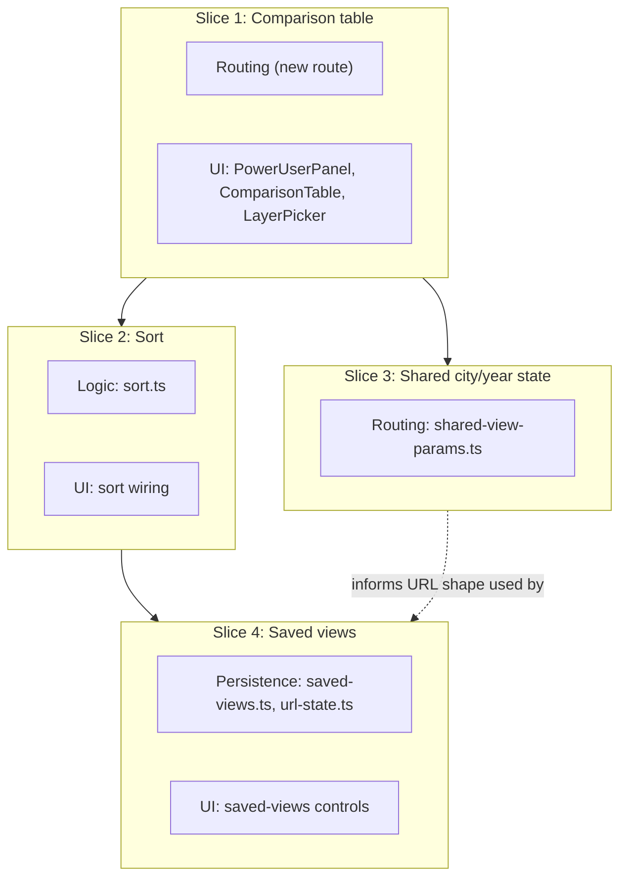

# Vertical Plan: Advanced Power-User Tab

## 1. Slicing Strategy

The horizontal plan identifies 4 real layers (routing/shared-state, UI, data/
logic, persistence) plus tests. The cut favors **proving the core comparison
experience first**, then layering sort, then cross-view state sharing, then
durable persistence last — persistence is the layer with the most "nice to
have but not core to the ask" character, and it's also the layer most easily
built from a working reference (allergy-locator's `profiles.ts`/`url-state.ts`),
so it's safe to defer without blocking a demoable result. Slice 1 is
deliberately thin: a real route rendering a real comparison table against real
data, with no sort and no persistence — that's already a genuinely useful,
demoable artifact (the operator can see 2+ datasets for a city side by side,
transparently labeled), not a scaffolding-only step.

## 2. Vertical Slice Plan

### Slice 1 — Comparison table, no sort, no persistence

- **Goal / what works after:** Navigating to `/mapstack/advanced` shows a real
  page where the user picks 2+ (dataset, layer) pairs via checkboxes and sees
  a table with one column per selection, each column header carrying that
  dataset's methodology note, one row per city.
- **Layers touched:** Routing (new route only, no shared-param work yet), UI
  (`PowerUserPanel`, `ComparisonTable`, `LayerPicker`), read-only use of
  `registry.ts`/`active-layers.ts`/`datasets/types.ts`.
- **NOT yet included:** sorting, shared city/year state with `/`, saved views.
- **Verified by:** Playwright e2e — navigate to the route, select 2 layers,
  assert the table renders with the expected columns and methodology text.
- **What the commit represents:** the first real, demoable slice of the
  power-user tab — proves the route/UI/data integration end to end.
- **Dependencies:** none (first slice).

### Slice 2 — Single-criterion sort

- **Goal / what works after:** Clicking a column header sorts the city rows
  by that column's value (asc/desc toggle).
- **Layers touched:** Data/logic (`src/lib/power-user/sort.ts`, new), UI
  (wire sort state + click handler into `ComparisonTable`).
- **NOT yet included:** shared city/year state, saved views.
- **Verified by:** Vitest unit tests on `sort.ts` (correctness, stability,
  handling of `null` values from `getValue`); Playwright e2e extends slice 1's
  spec to click a header and assert row order changes.
- **What the commit represents:** the tab's core "shortlist" capability —
  genuinely useful sorting without any cross-dataset combined score.
- **Dependencies:** Slice 1 (comparison table must exist to sort).

### Slice 3 — Shared city/year state across routes

- **Goal / what works after:** Selecting a city (or year) on `/` and
  navigating to `/mapstack/advanced` (or vice versa) preserves that selection
  via URL params (`?city=&year=`); each route reads on mount and writes on
  change via `router.replace`.
- **Layers touched:** Routing/shared-state (new shared param helper, e.g.
  `src/lib/shared-view-params.ts`, consumed by both `src/app/page.tsx`'s
  client component and the new advanced route).
- **NOT yet included:** saved views (this slice is about live navigation
  state, not durable storage).
- **Verified by:** Playwright e2e — select a city on `/`, follow a link to
  `/mapstack/advanced`, assert the same city is pre-selected; reverse
  direction too.
- **What the commit represents:** the two views stop feeling like disconnected
  pages and start feeling like one coherent app (resolves design-discussion
  open questions 2 and 6).
- **Dependencies:** Slice 1 (the advanced route must exist to receive shared
  state).

### Slice 4 — Saved views (persistence)

- **Goal / what works after:** The user can save the current selection set +
  sort choice as a named view, see a list of saved views, restore one
  (updating both the panel state and the URL), and delete/rename a saved view.
  Storage survives a full reload.
- **Layers touched:** Persistence (`src/lib/saved-views.ts`, `src/lib/url-state.ts`,
  both adapted from allergy-locator's `profiles.ts`/`url-state.ts`), UI (a
  small saved-views list/controls section in `PowerUserPanel`).
- **NOT yet included:** anything from the explicitly-deferred list in
  design-discussion §8 (import, chat, feedback, export, combined ranking).
- **Verified by:** Vitest unit tests on `saved-views.ts` (CRUD round-trip,
  fail-open on corrupt localStorage JSON — the specific behavior flagged as
  easy to drop during porting in design-discussion §4); Playwright e2e —
  save a view, reload the page, assert it's restored.
- **What the commit represents:** epic-complete — the full v1 power-user tab
  as scoped in the design discussion.
- **Dependencies:** Slice 1 (selections to save must exist), Slice 2 (sort
  choice is part of the saved shape).

## 3. Overlay Diagram

## 4. Deferred Items

- **Cross-dataset combined/weighted ranking** — removed from this epic
  entirely during the grill pass (design-discussion §3.3); would need a real
  normalization design first, tracked as a future epic.
- **CSV/data import** — no methodology-convention answer yet; future epic.
- **Chat-with-your-data / agent integration** — future epic.
- **Feedback/comments mechanism** — no precedent in either repo; not in scope.
- **Data export** — not in scope for this epic.
- **Cross-browser (beyond Chromium) and load/perf testing** — matches the
  existing e2e scope in this repo; not warranted at this app's scale.

## 5. Risk by Slice

- **Slice 1 — Low.** Purely additive (new route, new components), reads
  existing stable interfaces (`Dataset`, `registry.ts`). Dominant risk: UI
  layout/legibility of methodology notes in column headers (a design-
  discussion §4 medium risk, but a presentation concern, not a structural one).
- **Slice 2 — Low.** Pure-function sort logic over existing data; the
  dominant risk is a stability/edge-case bug (e.g. `null` values from
  `getValue()` for cities missing data) rather than anything architectural.
- **Slice 3 — Medium.** The dominant risk is exactly design-discussion §4's
  low-severity item promoted by real implementation contact: both routes must
  agree on param names/format, or the shared-state contract silently breaks
  (no error, just a dropped selection) — worth a shared constant/helper
  (already planned) rather than two independent implementations.
- **Slice 4 — Medium.** Dominant risk is porting allergy-locator's fail-open
  localStorage behavior incorrectly (design-discussion §4) — a rushed port
  could silently start throwing on corrupt JSON instead of failing open,
  which would be a regression relative to the reference implementation.

## 6. Moldability Notes

- Slices 2 and 3 touch disjoint layers (data/logic vs. routing) and have no
  dependency on each other — they could run in parallel as separate stories,
  or be reordered (3 before 2), without invalidating the rest of the plan.
- Slice 4 could be split further (save/restore vs. rename/delete) if it turns
  out larger than expected once slice 1-3 are actually built, since the CRUD
  surface has natural sub-boundaries.
- If slice 1 reveals the comparison-table UI needs more design iteration than
  expected (e.g., methodology-note placement doesn't read well), that
  iteration stays within slice 1's boundary — it doesn't block slices 2-4
  from proceeding on the underlying data/routing work in parallel with UI
  polish.
